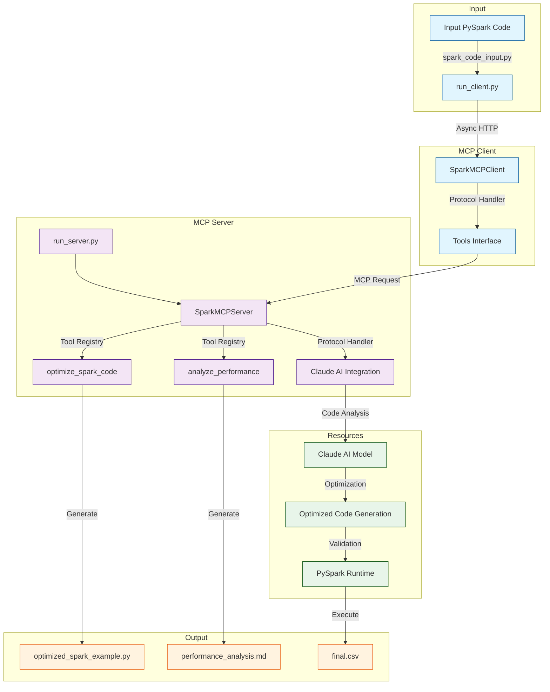
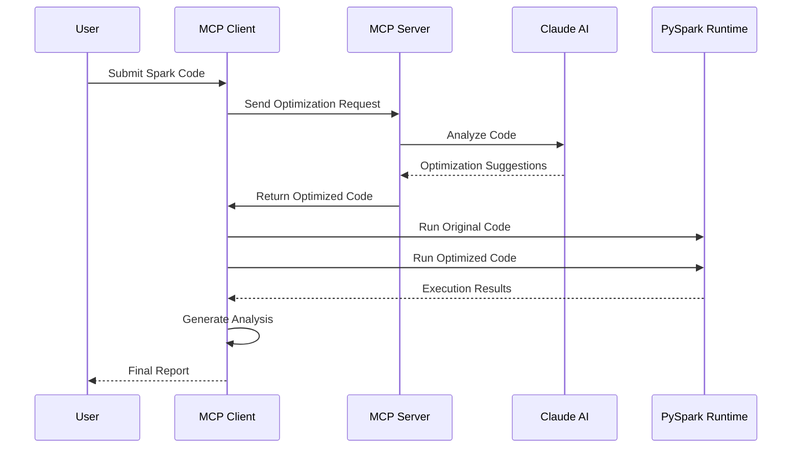

# Spark MCP (Model Context Protocol) Optimizer

This project implements a Model Context Protocol (MCP) server and client for optimizing Apache Spark code using Claude AI. The system provides intelligent code optimization suggestions and performance analysis through a client-server architecture.

## How It Works

### Code Optimization Workflow



### Component Details

1. **Input Layer**
   - `spark_code_input.py`: Source PySpark code for optimization
   - `run_client.py`: Client startup and configuration

2. **MCP Client Layer**
   - `SparkMCPClient`: Async client implementation
   - Tools Interface: Protocol-compliant tool invocation

3. **MCP Server Layer**
   - `run_server.py`: Server initialization
   - `SparkMCPServer`: Core server implementation
   - Tool Registry: Optimization and analysis tools
   - Protocol Handler: MCP request/response management

4. **Resource Layer**
   - Claude AI: Code analysis and optimization
   - PySpark Runtime: Code execution and validation

5. **Output Layer**
   - `optimized_spark_example.py`: Optimized code
   - `performance_analysis.md`: Detailed analysis
   - `final.csv`: Execution results

This workflow illustrates:
1. Input PySpark code submission
2. MCP protocol handling and routing
3. Claude AI analysis and optimization
4. Code transformation and validation
5. Performance analysis and reporting

## Architecture

This project follows the Model Context Protocol architecture for standardized AI model interactions:

```
┌──────────────────┐      ┌──────────────────┐      ┌──────────────────┐
│                  │      │   MCP Server     │      │    Resources     │
│   MCP Client     │      │  (SparkMCPServer)│      │                  │
│ (SparkMCPClient) │      │                  │      │ ┌──────────────┐ │
│                  │      │    ┌─────────┐   │      │ │  Claude AI   │ │
│   ┌─────────┐    │      │    │ Tools   │   │ <──> │ │   Model      │ │
│   │ Tools   │    │      │    │Registry │   │      │ └──────────────┘ │
│   │Interface│    │ <──> │    └─────────┘   │      │                  │
│   └─────────┘    │      │    ┌─────────┐   │      │ ┌──────────────┐ │
│                  │      │    │Protocol │   │      │ │  PySpark     │ │
│                  │      │    │Handler  │   │      │ │  Runtime     │ │
│                  │      │    └─────────┘   │      │ └──────────────┘ │
└──────────────────┘      └──────────────────┘      └──────────────────┘

        │                         │                          │
        │                         │                          │
        v                         v                          v
┌──────────────┐          ┌──────────────┐           ┌──────────────┐
│  Available   │          │  Registered  │           │   External   │
│    Tools     │          │    Tools     │           │  Resources   │
├──────────────┤          ├──────────────┤           ├──────────────┤
│optimize_code │          │optimize_code │           │ Claude API   │
│analyze_perf  │          │analyze_perf  │           │ Spark Engine │
└──────────────┘          └──────────────┘           └──────────────┘
```

### Components

1. **MCP Client**
   - Provides tool interface for code optimization
   - Handles async communication with server
   - Manages file I/O for code generation

2. **MCP Server**
   - Implements MCP protocol handlers
   - Manages tool registry and execution
   - Coordinates between client and resources

3. **Resources**
   - Claude AI: Provides code optimization intelligence
   - PySpark Runtime: Executes and validates optimizations

### Protocol Flow

1. Client sends optimization request via MCP protocol
2. Server validates request and invokes appropriate tool
3. Tool utilizes Claude AI for optimization
4. Optimized code is returned via MCP response
5. Client saves and validates the optimized code

### End-to-End Functionality



1. **Code Submission**
   - User places PySpark code in `input/spark_code_input.py`
   - Code is read by the MCP client

2. **Optimization Process**
   - MCP client connects to server via standardized protocol
   - Server forwards code to Claude AI for analysis
   - AI suggests optimizations based on best practices
   - Server validates and processes suggestions

3. **Code Generation**
   - Optimized code saved to `output/optimized_spark_example.py`
   - Includes detailed comments explaining optimizations
   - Maintains original code structure while improving performance

4. **Performance Analysis**
   - Both versions executed in PySpark runtime
   - Execution times compared
   - Results validated for correctness
   - Metrics collected and analyzed

5. **Results Generation**
   - Comprehensive analysis in `output/performance_analysis.md`
   - Side-by-side execution comparison
   - Performance improvement statistics
   - Optimization explanations and rationale

## Usage

## Requirements

- Python 3.8+
- PySpark 3.2.0+
- Anthropic API Key (for Claude AI)

## Installation

```bash
pip install -r requirements.txt
```

### Quick Start

1. Add your Spark code to optimize in `input/spark_code_input.py`

2. Start the MCP server:
```bash
python run_server.py
```

3. Run the client to optimize your code:
```bash
python run_client.py
```

This will generate two files:
- `output/optimized_spark_example.py`: The optimized Spark code with detailed optimization comments
- `output/performance_analysis.md`: Comprehensive performance analysis

4. Run and compare code versions:
```bash
python run_optimized.py
```

This will:
- Execute both original and optimized code
- Compare execution times and results
- Update the performance analysis with execution metrics
- Show detailed performance improvement statistics

## Project Structure

```
ai-mcp/
├── input/
│   └── spark_code_input.py     # Original Spark code to optimize
├── output/
│   ├── optimized_spark_example.py  # Generated optimized code
│   └── performance_analysis.md     # Detailed performance comparison
├── spark_mcp/
│   ├── client.py               # MCP client implementation
│   └── server.py               # MCP server implementation
├── run_client.py              # Client script to optimize code
├── run_server.py              # Server startup script
└── run_optimized.py           # Script to run and compare code versions
```


## Why MCP?

The Model Context Protocol (MCP) provides several key advantages for Spark code optimization:


### Direct Claude AI Call vs MCP Server

| Aspect | Direct Claude AI Call | MCP Server |
|--------|-----------------|------------|
| **Integration** | • Custom integration per team<br>• Manual response handling<br>• Duplicate implementations | • Pre-built client libraries<br>• Automated workflows<br>• Unified interfaces |
| **Infrastructure** | • No built-in validation<br>• No result persistence<br>• Manual tracking | • Automatic validation<br>• Result persistence<br>• Version control |
| **Context** | • Basic code suggestions<br>• No execution context<br>• Limited optimization scope | • Context-aware optimization<br>• Full execution history<br>• Comprehensive improvements |
| **Validation** | • Manual testing required<br>• No performance metrics<br>• Uncertain outcomes | • Automated testing<br>• Performance metrics<br>• Validated results |
| **Workflow** | • Ad-hoc process<br>• No standardization<br>• Manual intervention needed | • Structured process<br>• Standard protocols<br>• Automated pipeline |


### Key Differences:

#### 1. AI Integration

| Approach | Code Example | Benefits |
|----------|--------------|----------|
| Traditional | `client = anthropic.Client(api_key)`<br>`response = client.messages.create(...)` | • Complex setup<br>• Custom error handling<br>• Tight coupling |
| MCP | `client = SparkMCPClient()`<br>`result = await client.optimize_spark_code(code)` | • Simple interface<br>• Built-in validation<br>• Loose coupling |

#### 2. Tool Management

| Approach | Code Example | Benefits |
|----------|--------------|----------|
| Traditional | `class SparkOptimizer:`<br>&nbsp;&nbsp;`def register_tool(self, name, func):`<br>&nbsp;&nbsp;&nbsp;&nbsp;`self.tools[name] = func` | • Manual registration<br>• No validation<br>• Complex maintenance |
| MCP | `@register_tool("optimize_spark_code")`<br>`async def optimize_spark_code(code: str):` | • Auto-discovery<br>• Type checking<br>• Easy extension |

#### 3. Resource Management

| Approach | Code Example | Benefits |
|----------|--------------|----------|
| Traditional | `def __init__(self):`<br>&nbsp;&nbsp;`self.claude = init_claude()`<br>&nbsp;&nbsp;`self.spark = init_spark()` | • Manual orchestration<br>• Manual cleanup<br>• Error-prone |
| MCP | `@requires_resources(["claude_ai", "spark"])`<br>`async def optimize_spark_code(code: str):` | • Auto-coordination<br>• Lifecycle management<br>• Error handling |

#### 4. Communication Protocol

| Approach | Code Example | Benefits |
|----------|--------------|----------|
| Traditional | `{"type": "request",`<br>&nbsp;`"payload": {"code": code}}` | • Custom format<br>• Manual validation<br>• Custom debugging |
| MCP | `{"method": "tools/call",`<br>&nbsp;`"params": {"name": "optimize_code"}}` | • Standard format<br>• Auto-validation<br>• Easy debugging |

## Features

- **Intelligent Code Optimization**: Leverages Claude AI to analyze and optimize PySpark code
- **Performance Analysis**: Provides detailed analysis of performance differences between original and optimized code
- **MCP Architecture**: Implements the Model Context Protocol for standardized AI model interactions
- **Easy Integration**: Simple client interface for code optimization requests
- **Code Generation**: Automatically saves optimized code to separate files


### Advanced Usage

You can also use the client programmatically:

```python
from spark_mcp.client import SparkMCPClient

async def main():
    # Connect to the MCP server
    client = SparkMCPClient()
    await client.connect()

    # Your Spark code to optimize
    spark_code = '''
    # Your PySpark code here
    '''

    # Get optimized code with performance analysis
    optimized_code = await client.optimize_spark_code(
        code=spark_code,
        optimization_level="advanced",
        save_to_file=True  # Save to output/optimized_spark_example.py
    )
    
    # Analyze performance differences
    analysis = await client.analyze_performance(
        original_code=spark_code,
        optimized_code=optimized_code,
        save_to_file=True  # Save to output/performance_analysis.md
    )
    
    # Run both versions and compare
    # You can use the run_optimized.py script or implement your own comparison
    
    await client.close()
    
    # Analyze performance
    performance = await client.analyze_performance(spark_code, optimized_code)

    await client.close()
```

### Example Input and Output

The repository includes an example workflow:

1. **Input Code** (`input/spark_code_input.py`):
```python
# Create DataFrames and join
emp_df = spark.createDataFrame(employees, ["id", "name", "age", "dept", "salary"])
dept_df = spark.createDataFrame(departments, ["dept", "location", "budget"])

# Join and analyze
result = emp_df.join(dept_df, "dept") \
    .groupBy("dept", "location") \
    .agg({"salary": "avg", "age": "avg", "id": "count"}) \
    .orderBy("dept")
```

2. **Optimized Code** (`output/optimized_spark_example.py`):
```python
# Performance-optimized version with caching and improved configurations
spark = SparkSession.builder \
    .appName("EmployeeAnalysis") \
    .config("spark.sql.shuffle.partitions", 200) \
    .getOrCreate()

# Create and cache DataFrames
emp_df = spark.createDataFrame(employees, ["id", "name", "age", "dept", "salary"]).cache()
dept_df = spark.createDataFrame(departments, ["dept", "location", "budget"]).cache()

# Optimized join and analysis
result = emp_df.join(dept_df, "dept") \
    .groupBy("dept", "location") \
    .agg(
        avg("salary").alias("avg_salary"),
        avg("age").alias("avg_age"),
        count("id").alias("employee_count")
    ) \
    .orderBy("dept")
```

3. **Performance Analysis** (`output/performance_analysis.md`):
```markdown
## Execution Results Comparison

### Timing Comparison
- Original Code: 5.18 seconds
- Optimized Code: 0.65 seconds
- Performance Improvement: 87.4%

### Optimization Details
- Caching frequently used DataFrames
- Optimized shuffle partitions
- Improved column expressions
- Better memory management
```

## Project Structure

```
ai-mcp/
├── spark_mcp/
│   ├── __init__.py
│   ├── client.py      # MCP client implementation
│   └── server.py      # MCP server implementation
├── examples/
│   ├── optimize_code.py           # Example usage
│   └── optimized_spark_example.py # Generated optimized code
├── requirements.txt
└── run_server.py      # Server startup script
```

## Available Tools

1. **optimize_spark_code**
   - Optimizes PySpark code for better performance
   - Supports basic and advanced optimization levels
   - Automatically saves optimized code to examples/optimized_spark_example.py

2. **analyze_performance**
   - Analyzes performance differences between original and optimized code
   - Provides insights on:
     - Performance improvements
     - Resource utilization
     - Scalability considerations
     - Potential trade-offs

## Environment Variables

- `ANTHROPIC_API_KEY`: Your Anthropic API key for Claude AI

## Example Optimizations

The system implements various PySpark optimizations including:
- Broadcast joins for small-large table joins
- Efficient window function usage
- Strategic data caching
- Query plan optimizations
- Performance-oriented operation ordering

## Contributing

Feel free to submit issues and enhancement requests!

## License

MIT License
